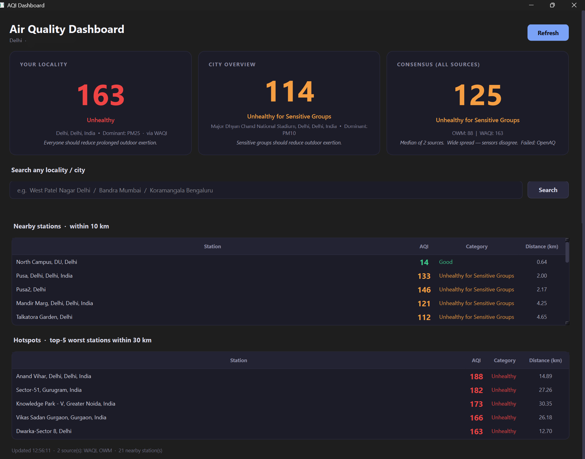

# AQI Dashboard — Windows Desktop App

> In a country like India, checking air quality is not optional — it is a survival mechanism. Degrading AQI over years has created documented links to respiratory disease, cardiovascular stress, and reduced cognitive function. This app puts that information in front of you automatically, every single day, before you leave home or start your work.


---

## The problem

Most people in Indian cities check AQI the same way they check weather — reactively, when they remember, when it's already too late to plan differently. The CPCB website is slow. Phone apps require unlocking, navigating, waiting. And none of them tell you whether the reading you're seeing is accurate or an outlier from a single malfunctioning sensor.

This app addresses that directly:

- **Zero friction** — opens automatically when your PC boots, no action required
- **Multi-source consensus** — queries four independent sensor networks and shows the median, not just one reading
- **Neighbourhood-level awareness** — not just your city, but your locality, nearby stations, and which areas to avoid that day

One glance when you sit down at your desk. That's it.

---

## Screenshots



---

## ⚠️ Transparency Disclaimer

**This app was built using AI (Claude by Anthropic) as the primary implementation tool.**

I did not write the Python from scratch. What I did:

- Defined the product requirements and feature scope from a real personal need
- Made every architectural decision — multi-source consensus design, geocoding approach, fallback chain, PWA vs APK trade-offs for mobile
- Directed every iteration: tested each build, identified what broke, specified what needed to change
- Owned all UI/UX decisions — layout, color system, information hierarchy, what to surface and how
- Debugged all deployment issues across Render, Railway, and Windows registry
- Set the quality bar and rejected outputs that didn't meet it

The judgment calls, the "this needs to work differently", and the debugging loop were mine. The Python syntax was not.

If you're a recruiter: this project demonstrates product thinking, system design intuition, and the ability to ship real tools end-to-end. It does not demonstrate raw Python implementation skills, which you can evaluate through other work.

---

## What it does

The dashboard opens automatically on every Windows boot and shows:

### 🏠 Your Locality
The AQI reading from the nearest physical monitoring station to your configured coordinates — with the dominant pollutant, station name, and a plain-language health advisory.

### 🏙️ City Overview
The city-level representative reading, which WAQI computes from a central station. Useful for understanding the broader trend vs your immediate neighbourhood.

### 📊 Consensus AQI
The median across all sources that responded. This is the number to trust. If three sources read 160–170 and one reads 290, the median filters out the outlier. A "wide spread" warning fires automatically when sources disagree by more than 50 AQI points.

### 📡 Nearby Stations — within 10 km
Every monitoring station within your configured radius, sorted by distance. Tells you which direction the air is better or worse, useful if you're deciding a walking or cycling route.

### 🔥 Hotspots — worst 5 within 30 km
The five highest-AQI stations in the wider area around you. If Anand Vihar is at 280 and your locality is at 140, you know not to drive through it. Gives you a spatial sense of where the pollution is concentrated that day.

### 🔍 Locality Search
Type any neighbourhood, colony, or city by name. The app geocodes it via OpenStreetMap, finds the nearest physical sensor to those coordinates, and returns the AQI. Works for any populated locality globally — not just cities that have named WAQI entries.

---

## Using it for your city — not just Delhi

The app works for **any city in the world** that has air quality monitoring stations. To set your location:

1. Find your coordinates on [Google Maps](https://maps.google.com) — right-click your location → the first line shows `lat, lng`
2. Open `config.json` and update:

```json
{
  "location": {
    "auto": false,
    "city": "Mumbai",
    "lat": 19.0760,
    "lng": 72.8777
  },
  "radius_km": 10,
  "hotspot_radius_km": 30
}
```

- `city` — used for the city-level feed query
- `lat` / `lng` — your precise location for nearby stations and locality AQI
- `radius_km` — how wide the nearby stations table searches (default 10 km)
- `hotspot_radius_km` — how wide the hotspot search goes (default 30 km)

Set `auto: false` always. IP-based geolocation in India is unreliable — ISPs route traffic through different cities and the app will think you're in the wrong place.

---

## Data sources & API setup

The app queries four independent sources. Each has a free tier more than sufficient for personal use.

### 1. WAQI — World Air Quality Index *(required)*
Aggregates CPCB, US Embassy monitors, IIT sensors, and private networks across India. The primary backbone — best station-level granularity for Indian cities.

**Get your free token:**
1. Go to [aqicn.org/data-platform/token](https://aqicn.org/data-platform/token/)
2. Enter your email → token arrives in minutes
3. Add to `config.json` as `"waqi_token"`

### 2. OpenWeatherMap *(recommended)*
Satellite and model-derived PM2.5, converted to US AQI. Genuinely independent methodology — not based on the same physical CPCB sensors as WAQI and OpenAQ. Provides the most valuable cross-check.

**Get your free key:**
1. Sign up at [openweathermap.org](https://openweathermap.org/api)
2. Go to API keys in your account
3. Add to `config.json` as `"openweather_key"`
4. Note: keys activate within 2 hours of generation

### 3. OpenAQ *(optional)*
Open-source aggregation of government monitoring data, including CPCB. A separate pipeline from WAQI pulling from the same underlying sensors — useful as a tie-breaker.

**Get your free key:**
1. Sign up at [explore.openaq.org](https://explore.openaq.org)
2. Go to API Keys in your profile
3. Add to `config.json` as `"openaq_key"`

### 4. IQAir *(optional — see note)*
Independent commercial sensor network with its own monitors, separate from CPCB. Free tier allows 100 requests/day.

> ⚠️ Note: IQAir's verification email has been flagged as suspicious by some antivirus software (Bitdefender, tested personally). Proceed at your own discretion. The app works fine without it.

**If you want it:** [iqair.com/dashboard](https://www.iqair.com/us/commercial-air-quality-monitors/api) → Add to `config.json` as `"iqair_key"`

---

## Setup

### Prerequisites
- Windows 10 or 11
- Python 3.10+ from [python.org](https://python.org) — **not** the Microsoft Store version (path quirks break the autostart registry hook)

### Install dependencies

```cmd
pip install -r requirements.txt
```

### Configure

```cmd
copy config.example.json config.json
notepad config.json
```

Fill in your API keys and coordinates. Minimum working config requires only `waqi_token`.

### Run

```cmd
python dashboard.py
```

### Install as Windows startup item

```cmd
python setup_autostart.py
```

This writes a single registry entry under `HKCU\Software\Microsoft\Windows\CurrentVersion\Run` pointing to `pythonw.exe dashboard.py`. No admin rights, no services, no Task Scheduler. The window opens silently on every login. Remove it anytime:

```cmd
python uninstall_autostart.py
```

---

## Technical implementation

### Language & runtime
- **Python 3.10+** — core language

### GUI framework
- **PySide6 (Qt 6)** — native Windows-style window, proper threading model via `QThread`, signal/slot architecture for async data fetching without freezing the UI

### Data & networking
- **`requests`** — HTTP client for all four API sources
- **Nominatim (OpenStreetMap)** — geocoding for the locality search (free, no key)
- **Photon (komoot)** — geocoding fallback

### Core algorithms
- **Haversine formula** — great-circle distance between coordinates, used for sorting nearby stations and filtering hotspots
- **EPA 2024 NAAQS breakpoints** — piecewise-linear PM2.5 to US AQI conversion (updated standard, not the commonly-used pre-2024 table)
- **Median consensus** — robust to outliers vs mean; one bad sensor doesn't skew the displayed number

### Persistence
- **JSON file cache** — stores last successful reading; loaded when all live sources fail (e.g. network not ready at boot)

### Auto-start
- **Windows Registry** `HKCU\...\Run` — per-user, no elevation required, `pythonw.exe` suppresses the console window

---

## Project structure

```
aqi-dashboard/
├── dashboard.py            # PySide6 UI + main entry point
├── aggregator.py           # Multi-source orchestration, consensus, fallback chain
├── waqi.py                 # WAQI API client
├── openaq.py               # OpenAQ v3 API client
├── openweather.py          # OWM client + PM2.5 → US AQI conversion
├── iqair.py                # IQAir client (optional)
├── geocoder.py             # Locality name → lat/lng (Nominatim + Photon)
├── geolocation.py          # IP-based location detection
├── cache.py                # JSON-backed last-known-good snapshot
├── setup_autostart.py      # Writes Windows registry startup entry
├── uninstall_autostart.py  # Removes it
├── config.example.json     # Template — copy to config.json and add your keys
└── requirements.txt        # PySide6, requests
```

---

## Limitations

- **US AQI scale, not Indian** — WAQI normalises all readings to the US EPA scale. CPCB publishes on Indian breakpoints which diverge in the 100–200 band. If you need CPCB-native numbers, the source would need to be replaced with direct CPCB scraping.
- **Real-time hotspots** — a spike from fireworks or a fire appears as a hotspot for that session. Chronic hotspot identification would require historical data logging, which this version does not do.
- **No threshold alerts** — the app surfaces information at boot only. It does not monitor continuously or notify you if AQI spikes mid-day.
- **Windows only** — the auto-start mechanism is registry-based. A companion mobile PWA version (FastAPI + Railway) is maintained separately.


*Built out of a genuine need to make AQI awareness effortless in a city where it directly affects daily decisions.*  
*AI-assisted development — see disclaimer above.*
